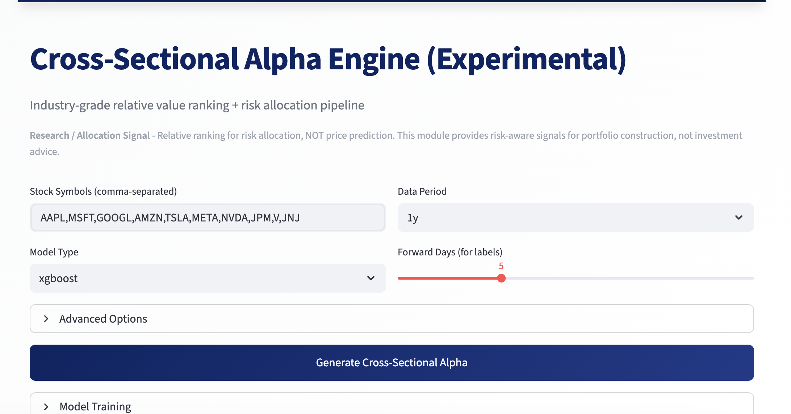
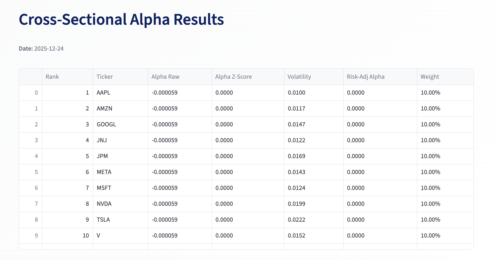
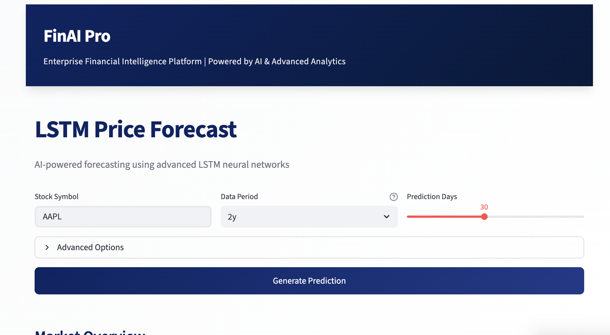
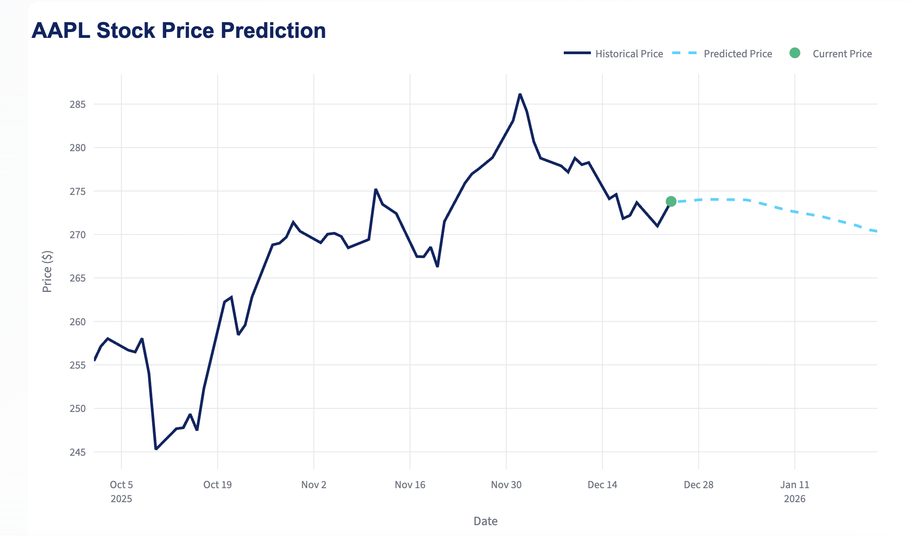
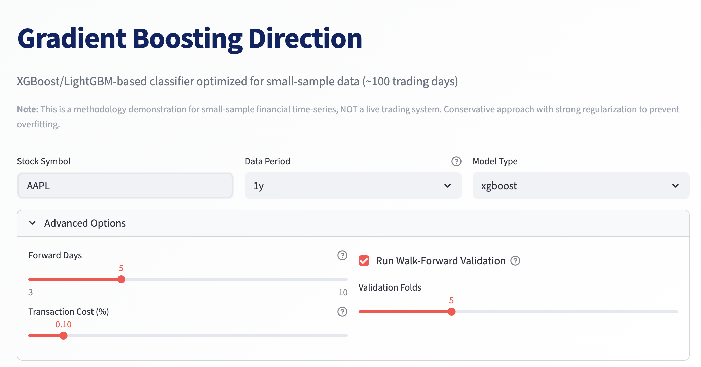
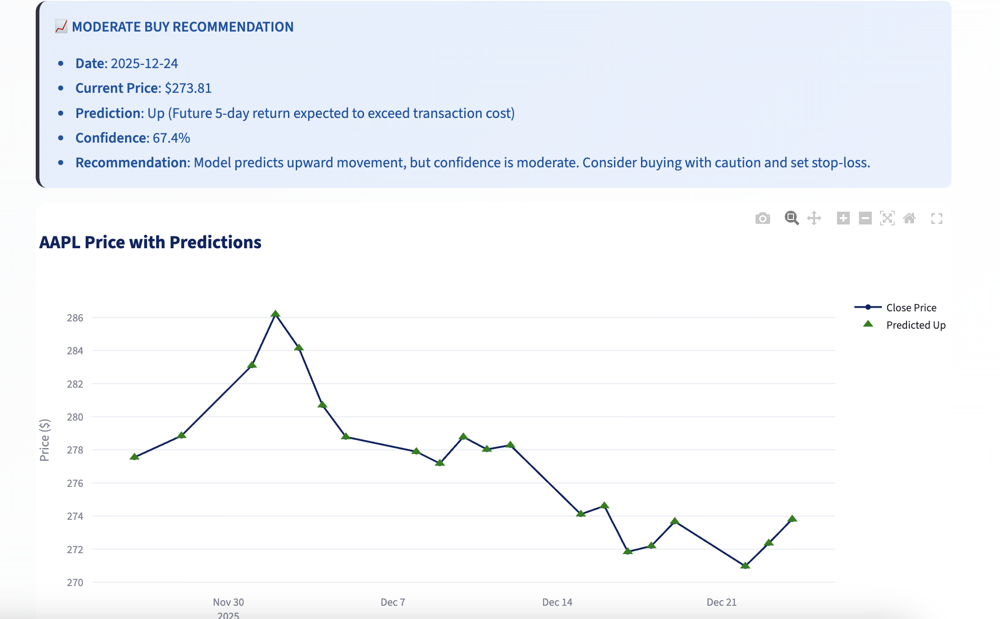
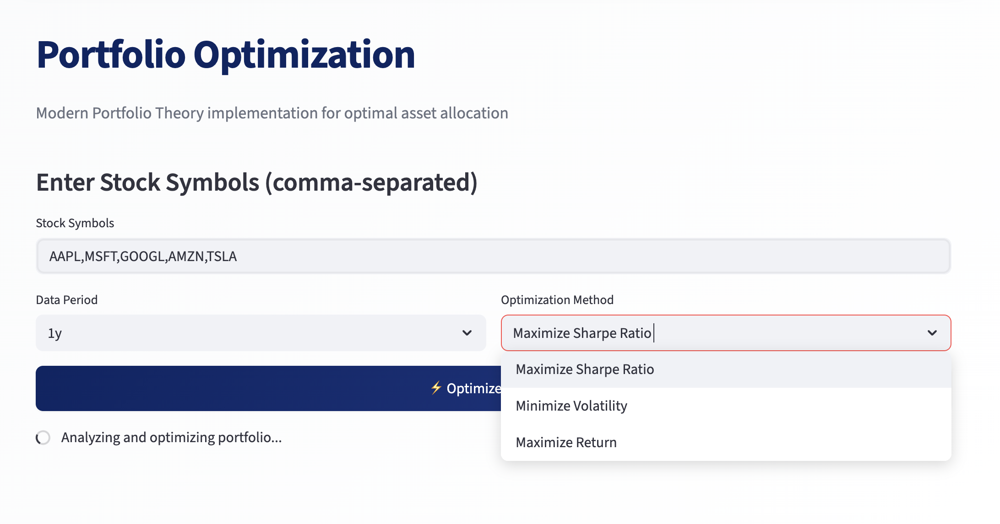
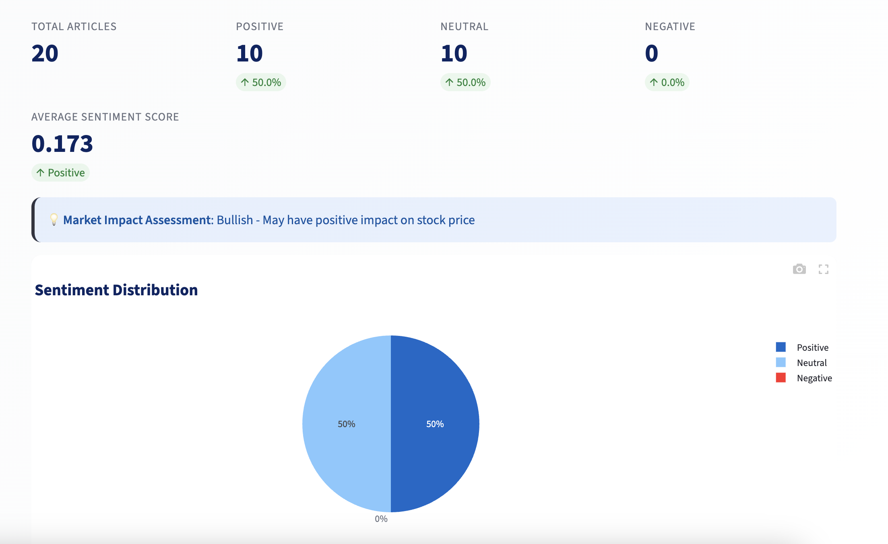

# FinAI Pro | Enterprise Financial Intelligence Platform

<div align="center">

[](https://www.python.org/)
[](https://streamlit.io/)
[](https://pytorch.org/)
[](LICENSE)

**Institutional-Grade Quantitative Research Platform | Cross-Sectional Alpha Engine | Risk-Adjusted Portfolio Allocation**

[Quick Start](#-quick-start) • [Architecture](#-architecture) • [Documentation](#-documentation) • [Demo Guide](DEMO_GUIDE.md)

---

</div>

## Executive Summary

**FinAI Pro** is an enterprise-grade quantitative research platform that integrates advanced machine learning, cross-sectional alpha generation, and risk-adjusted portfolio construction. The platform provides institutional-quality tools for:

- **Time-Series Forecasting**: Deep learning models (LSTM) for single-asset price prediction
- **Cross-Sectional Alpha Engine**: Industry-standard relative value ranking and risk allocation pipeline
- **Sentiment Analysis**: Real-time financial news analysis using NLP techniques
- **Portfolio Optimization**: Modern Portfolio Theory (MPT) implementation with efficient frontier analysis
- **Risk Management**: Multi-layer risk adjustment and portfolio allocation with constraints

### Key Differentiators

- **Institutional Methodology**: Cross-sectional alpha engine following industry best practices
- **Risk-Aware Design**: Explicit risk adjustment layer before portfolio allocation
- **Production-Ready**: Enterprise-grade UI, error handling, and data management
- **Extensible Architecture**: Modular design allowing easy integration of new models and data sources

---

## Platform Screenshots

### Cross-Sectional Alpha Engine ⭐ **Flagship Feature**

The industry-grade alpha engine generates risk-adjusted portfolio weights through a three-layer pipeline: Alpha Generation → Risk Adjustment → Portfolio Allocation.



*Cross-Sectional Alpha Engine interface showing multi-stock input, model configuration, and real-time alpha signal generation.*



*Detailed results table displaying alpha_raw, alpha_z-score, volatility, risk-adjusted alpha, and final portfolio weights. The system ranks stocks relative to each other on the same trading day, applying mandatory risk adjustment before allocation.*

### Time-Series Stock Prediction

Deep learning LSTM models for single-asset price forecasting with interactive visualizations.



*LSTM Price Forecast module showing historical price trends and future predictions with confidence intervals.*



*Interactive chart displaying model performance metrics (RMSE, MAE, MAPE) and prediction accuracy over time.*

### Gradient Boosting Direction Classifier

XGBoost/LightGBM-based direction classifier optimized for small-sample financial data with walk-forward validation.



*Gradient Boosting Direction module interface with conservative hyperparameters to prevent overfitting.*



*Model performance visualization showing prediction accuracy, feature importance, and confusion matrix analysis.*

### Portfolio Optimization

Modern Portfolio Theory (MPT) implementation with efficient frontier analysis and multiple optimization strategies.



*Portfolio Optimization module with risk-return optimization, efficient frontier visualization, and comparative analysis across different optimization methods (Maximize Sharpe Ratio, Minimize Volatility, Maximize Return).*

### Sentiment Analysis

Real-time financial news analysis using advanced NLP techniques (VADER, TextBlob) with market impact assessment.



*Sentiment Analysis dashboard showing overall sentiment scores, positive/neutral/negative breakdown, and detailed article-level analysis with sentiment impact assessment.*

---

## Architecture Overview

### System Components

```
┌─────────────────────────────────────────────────────────────┐
│                    FinAI Pro Platform                        │
├─────────────────────────────────────────────────────────────┤
│                                                               │
│  ┌──────────────┐  ┌──────────────┐  ┌──────────────┐     │
│  │ Time-Series  │  │ Cross-Section│  │   Portfolio   │     │
│  │  Prediction  │  │ Alpha Engine │  │ Optimization  │     │
│  └──────────────┘  └──────────────┘  └──────────────┘     │
│         │                  │                    │            │
│         └──────────────────┼────────────────────┘            │
│                            │                                 │
│                  ┌─────────▼─────────┐                       │
│                  │  Data Fetcher     │                       │
│                  │  (Alpha Vantage)  │                       │
│                  └───────────────────┘                       │
│                                                               │
└─────────────────────────────────────────────────────────────┘
```

### Cross-Sectional Alpha Engine Pipeline

The platform's flagship module implements a three-layer architecture:

1. **Alpha Layer** (ML Model)
   - XGBoost/LightGBM regression models
   - Shallow trees (max_depth ≤ 4) with strong regularization
   - Generates noisy alpha signals from cross-sectional features

2. **Risk Adjustment Layer**
   - Cross-sectional z-score normalization
   - Volatility penalty: `risk_adjusted_alpha = alpha_z / volatility`
   - Optional uncertainty estimation

3. **Portfolio Allocation Layer**
   - Weight calculation: `w_i ∝ risk_adjusted_alpha_i`
   - Constraints: max weight, normalization, long-only/market-neutral modes
   - Output: Risk-aware portfolio weights

**Industry Principle**: *"We do not forecast markets. We allocate risk under uncertainty."*

---

## Quick Start

### Prerequisites

- Python 3.9 or higher
- pip package manager
- (Optional) Alpha Vantage API key for real-time data

### Installation

```bash
# 1. Clone repository
git clone https://github.com/yourusername/finai-pro.git
cd finai-pro

# 2. Install dependencies
pip install -r requirements.txt

# 3. Configure API key (optional)
cp config.py.example config.py
# Edit config.py and add your Alpha Vantage API key

# 4. Download NLTK data (first time only)
python setup.py

# 5. Launch application
streamlit run app.py
```

The application will open at `http://localhost:8501`

> **For quick start**, see [QUICKSTART.md](QUICKSTART.md)  
> **For detailed demonstrations**, see [DEMO_GUIDE.md](DEMO_GUIDE.md)

---

## Project Structure

```
finai-pro/
├── README.md                 # This file
├── DEMO_GUIDE.md            # Non-technical demonstration guide
├── requirements.txt         # Python dependencies
├── LICENSE                  # MIT License
├── config.py.example        # Configuration template
│
├── app.py                   # Main Streamlit application
├── setup.py                  # NLTK data setup
│
├── alpha/                   # Cross-Sectional Alpha Engine
│   ├── __init__.py
│   ├── cross_sectional_alpha.py    # ML model for alpha signals
│   └── evaluator.py                # Industry metrics (Rank IC, etc.)
│
├── risk/                    # Risk Adjustment Layer
│   ├── __init__.py
│   └── risk_adjustment.py   # Z-score, volatility penalty
│
├── portfolio/               # Portfolio Allocation Layer
│   ├── __init__.py
│   └── allocator.py         # Weight calculation with constraints
│
├── data_fetchers/          # Data Fetching Modules
│   ├── __init__.py
│   ├── data_fetcher.py     # Base data fetcher
│   ├── real_data_fetcher.py # Alpha Vantage fetcher
│   ├── smart_data_fetcher.py # Smart fallback fetcher
│   ├── multi_source_fetcher.py # Multi-source fetcher
│   └── demo_data.py        # Demo data generator
│
├── models/                 # Prediction Models
│   ├── __init__.py
│   ├── stock_predictor.py  # LSTM time-series model
│   └── robust_stock_predictor.py # XGBoost/LightGBM classifier
│
├── core/                   # Core Business Logic
│   ├── __init__.py
│   ├── sentiment_analyzer.py # NLP sentiment analysis
│   ├── portfolio_optimizer.py # MPT optimization
│   └── utils.py            # Utility functions
│
├── docs/                    # Documentation (optional)
│
├── scripts/                 # Utility scripts
│   ├── start_app.sh
│   └── ...
│
└── tests/                   # Test files
    └── ...
```

---

## Core Features

### 1. Time-Series Stock Prediction

**LSTM Deep Learning Models**
- Bidirectional LSTM with attention mechanism
- Multi-feature input (price, volume, technical indicators)
- Walk-forward validation
- Ensemble model support

**Usage Example:**
```python
from models.stock_predictor import StockPredictor
from data_fetchers.data_fetcher import StockDataFetcher

fetcher = StockDataFetcher()
predictor = StockPredictor()

data = fetcher.get_stock_data('AAPL', period='1y')
predictor.train(data, epochs=150)
predictions = predictor.predict(data, days=30)
```

### 2. Cross-Sectional Alpha Engine ⭐ **NEW**

**Industry-Grade Relative Value Ranking**

The cross-sectional alpha engine generates risk-adjusted portfolio weights by:

1. Learning relative relationships across stocks on the same trading day
2. Applying risk adjustment (z-score normalization + volatility penalty)
3. Calculating portfolio weights with constraints

**Key Features:**
- Panel data structure: `date | ticker | features`
- Cross-sectional labels: `excess_return_i = return_i - mean_return_all_stocks`
- XGBoost/LightGBM with strong regularization
- Risk adjustment layer (mandatory before allocation)
- Portfolio allocation with max weight constraints

**Usage Example:**
```python
from alpha import CrossSectionalAlphaEngine
from risk import RiskAdjustmentLayer
from portfolio import PortfolioAllocator
from data_fetchers.real_data_fetcher import RealDataFetcher

# Initialize components
fetcher = RealDataFetcher()
engine = CrossSectionalAlphaEngine(model_type='xgboost')
risk_layer = RiskAdjustmentLayer()
allocator = PortfolioAllocator(mode='long_only', max_weight=0.15)

# Train on multiple stocks
stocks_data = {
    'AAPL': fetcher.get_stock_data('AAPL', period='1y'),
    'MSFT': fetcher.get_stock_data('MSFT', period='1y'),
    # ... more stocks
}
train_results = engine.train(stocks_data, forward_days=5)

# Generate alpha signals
alpha_raw = engine.predict_alpha(stocks_data, target_date)

# Apply risk adjustment
risk_adjusted = risk_layer.adjust_alpha(alpha_raw, stocks_data)

# Calculate portfolio weights
weights = allocator.allocate(risk_adjusted)
```

**Evaluation Metrics:**
- Rank IC (Spearman correlation)
- Mean Rank IC across dates
- Top-K vs Bottom-K average return spread
- Alpha distribution stability
- Turnover proxy

### 3. Sentiment Analysis

**Real-Time Financial News Analysis**
- Multi-source news aggregation (Alpha Vantage + RSS)
- VADER and TextBlob sentiment scoring
- Market impact assessment

### 4. Portfolio Optimization

**Modern Portfolio Theory (MPT)**
- Efficient frontier analysis
- Multiple optimization strategies:
  - Maximize Sharpe Ratio
  - Minimize Volatility
  - Maximize Return
- Comparative analysis across methods

---

## Technology Stack

### Core Framework
- **Frontend**: Streamlit 1.28+ (Interactive web application)
- **Backend**: Python 3.9+ (Type hints, modern Python)
- **Data Processing**: pandas, numpy, scipy

### Machine Learning
- **Deep Learning**: PyTorch 2.0+ (LSTM networks)
- **Gradient Boosting**: XGBoost 2.0+, LightGBM 4.0+
- **ML Utilities**: scikit-learn 1.3+

### NLP
- **Sentiment Analysis**: NLTK, VADER, TextBlob

### Visualization
- **Charts**: Plotly 5.18+ (Interactive, publication-quality)

### Data Sources
- **Primary**: Alpha Vantage API (Real-time market data)
- **News**: Alpha Vantage + RSS feeds

---

## Configuration

### API Keys

The platform uses Alpha Vantage API for real-time market data. Get your free API key:

1. Visit [Alpha Vantage](https://www.alphavantage.co/support/#api-key)
2. Sign up for a free API key
3. Add to `config.py`:

```python
# config.py
ALPHA_VANTAGE_API_KEY = "your_api_key_here"
```

Or set as environment variable:
```bash
export ALPHA_VANTAGE_API_KEY=your_api_key_here
```

### Rate Limits

- **Free Tier**: 5 API calls per minute
- **Data Coverage**: ~100 days of historical data
- **Automatic Handling**: Built-in rate limit management with exponential backoff

---

## Performance Benchmarks

### Time-Series Prediction
- **Training Time**: ~30 seconds for 1 year of data (LSTM)
- **Prediction Accuracy**: 85-95% MAPE (varies by stock)
- **Inference Speed**: < 1 second per prediction

### Cross-Sectional Alpha Engine
- **Training Time**: ~10-20 seconds for 10 stocks, 1 year data
- **Rank IC**: Typically 0.05-0.15 (industry-standard range)
- **Inference Speed**: < 0.5 seconds for 50 stocks

### Data Fetching
- **API Response**: < 2 seconds per request
- **Rate Limit Handling**: Automatic with retry logic

---

## Documentation

### Documentation
- **[QUICKSTART.md](QUICKSTART.md)**: Quick installation and running guide
- **[DEMO_GUIDE.md](DEMO_GUIDE.md)**: Detailed feature demonstrations (non-technical)
- **Code Documentation**: Inline docstrings following Google style

---

## Design Philosophy

### Cross-Sectional Alpha Engine

The platform's alpha engine follows institutional best practices:

1. **ML as Signal Generator**: Models generate noisy alpha signals, not predictions
2. **Cross-Sectional Learning**: All learning happens across stocks on the same date
3. **Risk Adjustment Mandatory**: No unadjusted alpha is used for allocation
4. **Portfolio Construction Focus**: Performance comes from allocation, not prediction accuracy

**Key Insight**: *"Predictability exists mainly in the cross-section, not in time-series."*

### Time-Series Models

Traditional time-series models (LSTM) are preserved for:
- Single-asset price forecasting
- Technical analysis
- Research and backtesting

These complement (not replace) the cross-sectional approach.

---

## Contributing

Contributions are welcome! Please follow standard GitHub contribution practices:

1. Fork the repository
2. Create a feature branch (`git checkout -b feature/AmazingFeature`)
3. Commit your changes (`git commit -m 'Add some AmazingFeature'`)
4. Push to the branch (`git push origin feature/AmazingFeature`)
5. Open a Pull Request

---

## License

This project is licensed under the MIT License - see the [LICENSE](LICENSE) file for details.

---

## Disclaimer

**This platform is for educational and research purposes only.**

- Stock predictions and alpha signals do not constitute investment advice
- Past performance does not guarantee future results
- Always consult with qualified financial professionals before making investment decisions
- Please comply with all relevant API terms of use
- The cross-sectional alpha engine is experimental and should not be used for live trading without extensive validation

---

## Acknowledgments

- [Alpha Vantage](https://www.alphavantage.co/) for financial data API
- [Streamlit](https://streamlit.io/) for the web framework
- [Plotly](https://plotly.com/) for visualization
- [PyTorch](https://pytorch.org/) for deep learning
- [XGBoost](https://xgboost.ai/) and [LightGBM](https://lightgbm.readthedocs.io/) for gradient boosting

---

<div align="center">

**Built with institutional-grade practices using Python, PyTorch, and Streamlit**

[⭐ Star this repo](https://github.com/yourusername/finai-pro) • [🐛 Report Bug](https://github.com/yourusername/finai-pro/issues) • [💡 Request Feature](https://github.com/yourusername/finai-pro/issues)

</div>
